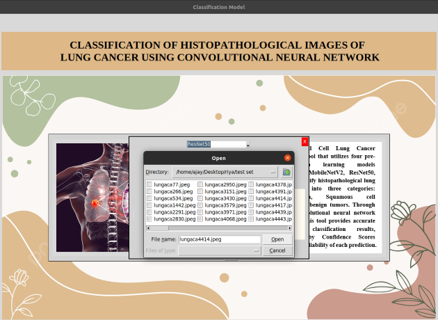

# **tensorflow-python-based-GUI-for-histopathological-image-classification**

## **Objective:**

The objective of this GUI is to classify histopathological images of non-small cell lung cancer using deep learning architecture.

## **Language Used:**

Python 3.8

## **Libraries/Packages Used:**

- Tensorflow
- Keras
- tkinter

## **DataSet:**

The dataset was taken from kaggle repository (https://www.kaggle.com/datasets/andrewmvd/lung-and-colon-cancer-histopathological-images). The dataset is called LC25000 dataset it contains 25000 images divided into 2 subtypes of colon cancer and 3 subtypes of lung cancer. It contain 15000 histopathological images of three sub classes - Adenocarcinoma, Squamous cell carcinoma and benign lung tissue.

## Procedure:

- classification of 3 classes of lung cancer using the transfer learning approach was performed using 4 pre-trained models=DenseNet121, MobileNetv2, Resnet50, VGG16
- During training classification k-fold validation was applied, where k=5
- Then the model giving the best performance among the 5 folds was selected and saved
- These saved models were then loaded into a graphical user interface (GUI) which displays the prediction of the model selected alongwith the confidence score.

## Parameters:

- Batch size = 32
- Input size of image =  (224,224)
- Epochs = 25
- Learning rate = 0.001
- Optimizer = Adam

## GUI Overview:

